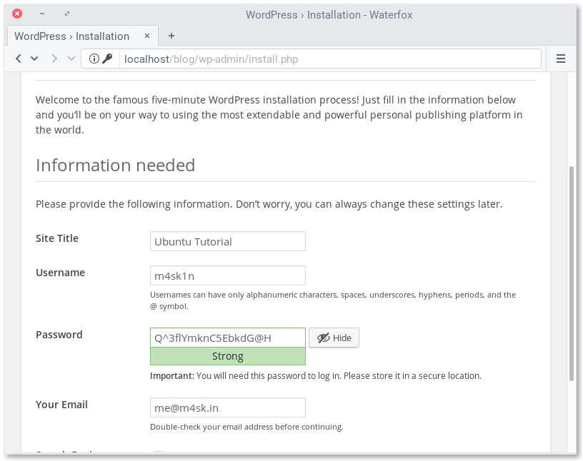
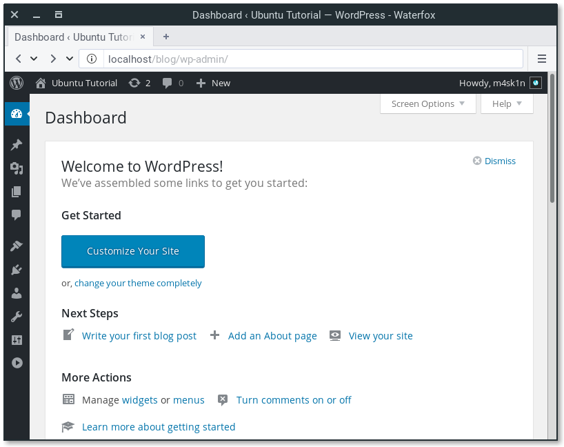

# Wordpress

Um simples script que tem como finalidade provisionar um wordpress numa máquina virtual.

## 📋 Pré-requisitos

Você precisa somente e apenas do Software abaixo instalado em seu equipamento:

```
Vagrant (latest)
```

## 🚀 Começando
Com o vagrant já instalado execute os 3x passos abaixo:

** 01 Passo - Baixe arquivos 'VagrantFile' e 'provision.sh'.
** 02 Passo - Coloque os arquivos dentro de um mesmo diretório
** 03 Passo - Execute o comando 'vagrant up'

Será realizada a configuração do seu wordpress e ao final será exibido 1 IP, que você possa testar o mesmo.

### Configuração do Wordpress
Selecione o idioma de instalação.

Realize a configuração de usuário e senha do wordpress.


Feito isso você já estará com acesso ao dashboard do wordpress.

